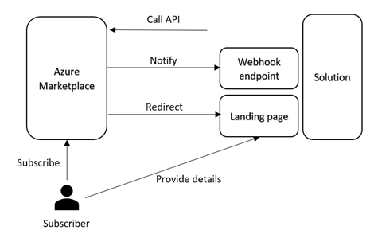

# Azure Marketplace SaaS Fulfillment API Client

An experimental .NET client implementation for the Azure Marketplace SaaS Fulfillment API V2. 
I built this project as a part of a sample I am developing for demonstrating how SaaS applications can be integrated with Azure Marketplace.

The Azure SaaS Fulfillment API V2 reference is: [here](https://docs.microsoft.com/en-us/azure/marketplace/cloud-partner-portal/saas-app/cpp-saas-fulfillment-api-v2#update-a-subscription).

There is also a Postman collection showing the mock API.

This client is based on the mock API referenced in the article above.

The client is also available as a Nuget package at https://www.nuget.org/packages/AzureMarketplaceSaaSApiClient/

## Using the library

Register a new AAD application as described in the [documentation](https://docs.microsoft.com/en-us/azure/active-directory/develop/scenario-web-app-call-api-app-registration) and keep the secret. I recommend you to have a separate AAD application for API integration other than the one used in the landing page. This application can be single-tenant.

The library does not implement certificate authentication yet, but I love to see PRs. Please feel free to submit. So generate a key on the portal, and keep it in your favorite secret location, such as [KeyVault](https://docs.microsoft.com/en-us/aspnet/core/security/key-vault-configuration?view=aspnetcore-2.2). I use ```dotnet user-secrets``` for my development.

If you are using dotnet dependency injection, there is an [extension method](https://github.com/Ercenk/AzureMarketplaceSaaSApiClient/blob/master/src/FulfillmentClientServiceCollectionExtensions.cs) for you. Please see the usage in the [test](https://github.com/Ercenk/AzureMarketplaceSaaSApiClient/blob/master/test/SaaSFulfillmentClientTests/WebHookTests.cs#L76) for registering the types and inject to the classes using those.

The registration call looks like following in my samples' [startup classes](https://github.com/Ercenk/ContosoAMPBasic/blob/master/src/Dashboard/Startup.cs#L84).

```csharp
            services.AddFulfillmentClient(
                options => this.configuration.Bind("FulfillmentClient", options),
                credentialBuilder => credentialBuilder.WithClientSecretAuthentication(
                    this.configuration["FulfillmentClient:AzureActiveDirectory:AppKey"]));
```

### Webhook processing

Implement IWebhookHandler interface to your liking. 

If you are using dotnet dependency injection, again, I have an extension method. You can register the types with,

``` csharp
            services.AddWebhookProcessor().WithWebhookHandler<ContosoWebhookHandler>();
```

The [WebhookProcessor](https://github.com/Ercenk/AzureMarketplaceSaaSApiClient/blob/master/src/WebHook/WebhookProcessor.cs#L77) class takes care of validating the webhook call by the AMP commerce engine, and calls the handler's appropriate methods. Then call the ```ProcessWebhookNotificationAsync``` method in your webhook endpoint code.

### **Breaking changes for version 2.0.0**
- Incorporated Azure AD
- Changed the interface on the client to remove the external bearer token. The client now implements Azure AD authentication.
- Currently only app secret (AppKey) is implemented (no certificate authentication)

### **New functionality**
- Added Web Hook processing capability


# Integrating a Software as a Solution with Azure Marketplace

Many different types of solution offers are available on Azure Marketplace for the customers to subscribe. Those different types include options such as virtual machines (VMs), solution templates, and containers, where a customer can deploy the solution to their Azure subscription. Azure Marketplace also provides the option to subscribe to a Software as a Service (SaaS) solution, which runs in an environment other than the customer's subscription.

A SaaS solution publisher needs to integrate with the Azure Marketplace commerce capabilities for enabling the solution to be available for purchase.

Azure Marketplace talks to a SaaS solution on two channels,

- Landing page: The Azure Marketplace redirects the subscriber to this page maintained by the subscriber to capture the details for provisioning the solution for the subscriber.
- Webhook: This is an endpoint where the Azure Marketplace notifies the solution for the events such as subscription cancel and update, or suspend request for the subscription, should the customer's payment method becomes unusable.

The SaaS solution in turn uses the REST API exposed on the Azure Marketplace side to perform corresponding operations. Those can be activating, cancelling, updating a subscription.

To summarize, we can talk about three interaction areas between the Azure Marketplace and the SaaS solution,

1. Landing page
2. Webhook endpoint
3. Calls on the Azure Marketplace REST API



Let's go through those integration areas to highlight key points.

## Landing page

A publisher provides the URL for this page when registering the offer for Azure Marketplace. This page should authenticate a subscriber through Azure Active Directory (AAD). The related AAD concepts are [here](https://docs.microsoft.com/en-us/azure/active-directory/develop/scenario-web-app-sign-user-overview). The publisher should register a multi-tenant AAD application for the landing page.

The publisher can collect other information from the subscriber to onboard the customer, and provision additional resources. The publisher's solution can also ask for consent to access other resources owned by the customer, and protected by AAD, such as Microsoft Graph API, Azure Management API etc.

## Webhook endpoint

This is the second URL the publisher provides when registering the offer. The Azure Marketplace calls this endpoint to notify the solution for the events happening on the marketplace side. Those events can be the cancellation, and update of the subscription through Azure Marketplace, or suspending it, because of the unavailability of customer's payment method.

This endpoint is not protected. The implementation should call the marketplace REST API to ensure the validity of the event.

## Marketplace REST API interactions

The publisher should register an AAD application and provide the AppID (ClientId) and the tenant ID (AAD directory where the app is registered) during registering the offer for the marketplace. The solution is put on a whitelist so it can call the marketplace REST API with those details. There is no OAuth 2.0 consent workflow for accessing the API. We recommend two separate AAD applications for the landing page and marketplace API interaction. The details of the API are [here for subscription integration](https://docs.microsoft.com/en-us/azure/marketplace/partner-center-portal/pc-saas-fulfillment-api-v2), and here for [usage based billing](https://docs.microsoft.com/en-us/azure/marketplace/partner-center-portal/marketplace-metering-service-apis).
