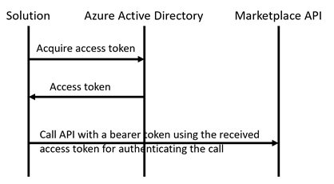

# Azure Marketplace SaaS Fulfillment API Client

**This is an experimental .NET client implementation for the Azure Marketplace SaaS Fulfillment API V2 for me to learn how to use it. I make frequent changes to this repo as I discover new things with the marketplace API. Please check back often.**

I built this project as a part of a sample I am developing for demonstrating how SaaS applications can be integrated with Azure Marketplace.

The Azure SaaS Fulfillment API V2 reference is: [here](https://docs.microsoft.com/en-us/azure/marketplace/cloud-partner-portal/saas-app/cpp-saas-fulfillment-api-v2#update-a-subscription).

There is also a Postman collection showing the mock API.

The client is also available as a Nuget package at https://www.nuget.org/packages/AzureMarketplaceSaaSApiClient/

## Using the library

Register a new AAD application as described in the [documentation](https://docs.microsoft.com/en-us/azure/active-directory/develop/scenario-web-app-call-api-app-registration) and keep the secret. I recommend you to have a separate AAD application for API integration other than the one used in the landing page. This application can be single-tenant.

The library does not implement certificate authentication yet, but I love to see PRs. Please feel free to submit. So generate a key on the portal, and keep it in your favorite secret location, such as [KeyVault](https://docs.microsoft.com/en-us/aspnet/core/security/key-vault-configuration?view=aspnetcore-2.2). I use ```dotnet user-secrets``` for my development environment.

If you are using dotnet dependency injection, there is an [extension method](https://github.com/Ercenk/AzureMarketplaceSaaSApiClient/blob/master/src/FulfillmentClientServiceCollectionExtensions.cs) for you. Please see the usage in the [test](https://github.com/Ercenk/AzureMarketplaceSaaSApiClient/blob/master/test/SaaSFulfillmentClientTests/WebHookTests.cs#L76) for registering the types and inject to the classes using those.

The registration call looks like following in my samples' [startup classes](https://github.com/Ercenk/ContosoAMPBasic/blob/master/src/Dashboard/Startup.cs#L84).

```csharp
            services.AddFulfillmentClient(
                options => this.configuration.Bind("FulfillmentClient", options));
```

### Webhook processing

Implement IWebhookHandler interface to your liking. 

If you are using dotnet dependency injection, again, I have an extension method. You can register the types with,

``` csharp
            services.AddWebhookProcessor().WithWebhookHandler<ContosoWebhookHandler>();
```

The [WebhookProcessor](https://github.com/Ercenk/AzureMarketplaceSaaSApiClient/blob/master/src/WebHook/WebhookProcessor.cs#L77) class takes care of validating the webhook call by the AMP commerce engine, and calls the handler's appropriate methods. Then call the ```ProcessWebhookNotificationAsync``` method in your webhook endpoint code.

### Operations Store

Although the API provides a "List outstanding operation" call, as the name states, it returns only the operations that are in progress. If you want to retrieve the status of an operation, such as "DELETE" or "PATCH" requests, you need to keep track of the operations.
This new capability adds a way to store the resulting operations, and enables you to query the result of the operation by using ```GetSubscriptionOperationAsync``` method.

Just use the following if you want to use it with ASP.NET 

``` csharp
            services.AddFulfillmentClient(
                options => this.configuration.Bind("FulfillmentClient", options))
                .WithAzureTableOperationsStore(this.configuration["OperationsStoreConnectionString"]);
```

If you wish to use your own implementation for the store, you can register it with ```WithOperationsStore```. Please see the source.

### How does the authentication work for calling the API?

I recommend to register a separate Azure Active Directory App for calling the API, and make it single tenant. The first step for a publisher is to register an Azure AD app, and record its details (Tenant Id and App Id, a.k.a. Client Id) on the Commercial Marketplace portal.

The API client accepts the Tenant Id, App Id, and App secret as properties of ```SecuredFulfillmentClientConfiguration ```, and uses those to grab an access token from Azure AD. The high level scenario for a web app calling an API with the stored application secret is [here](https://docs.microsoft.com/en-us/azure/active-directory/develop/scenario-web-app-call-api-overview).

The dance of an authenticated solution with the Marketplace API works like this.

- Access the Azure AD authentication endpoint to grab an access token. You will need to provide the client Id, client secret and a resource (default value is "62d94f6c-d599-489b-a797-3e10e42fbe22" as listed in the [documentation](https://docs.microsoft.com/en-us/azure/marketplace/partner-center-portal/pc-saas-registration#get-a-token-based-on-the-azure-ad-app)). Please note that this is the V1 endpoint for Azure AD. V2 endpoint does not accept a resource, but a "scope" with a URL format. The API client uses the following code to get the access token. Please see the use of Client ID, Client Secret and resource ID below. The tenant ID is passed in the URL for the authentication endpoint. The following code snippet is from the [AdApplicationHelper class](https://github.com/Ercenk/AzureMarketplaceSaaSApiClient/blob/master/src/AzureAD/AdApplicationHelper.cs):

    ```C#
                var credential = new ClientCredential(options.AzureActiveDirectory.ClientId.ToString(), options.AzureActiveDirectory.AppKey);
                var authContext = new AuthenticationContext(authenticationEndpoint + options.AzureActiveDirectory.TenantId, false);
                var token = await authContext.AcquireTokenAsync(marketplaceResourceId, credential);
                return token.AccessToken;
    ```

- Make a bearer token by prepending "Bearer " to the access token, as show in the following code snippet ([RestClient class](https://github.com/Ercenk/AzureMarketplaceSaaSApiClient/blob/master/src/RestClient.cs#L48)) and set it to the "Authorization" header of the request

    ```C#
        request.Headers.Authorization = new AuthenticationHeaderValue("Bearer", bearerToken);
    ```

- Call the API

 

Since you have provided the Tenant ID and App ID as part of the offer setup, the Commercial Marketplace side expects to receive calls from your API client. Please see the "[Techincal configuration](https://docs.microsoft.com/en-us/azure/marketplace/partner-center-portal/create-new-saas-offer#technical-configuration)" section for creating a SaaS offer.
